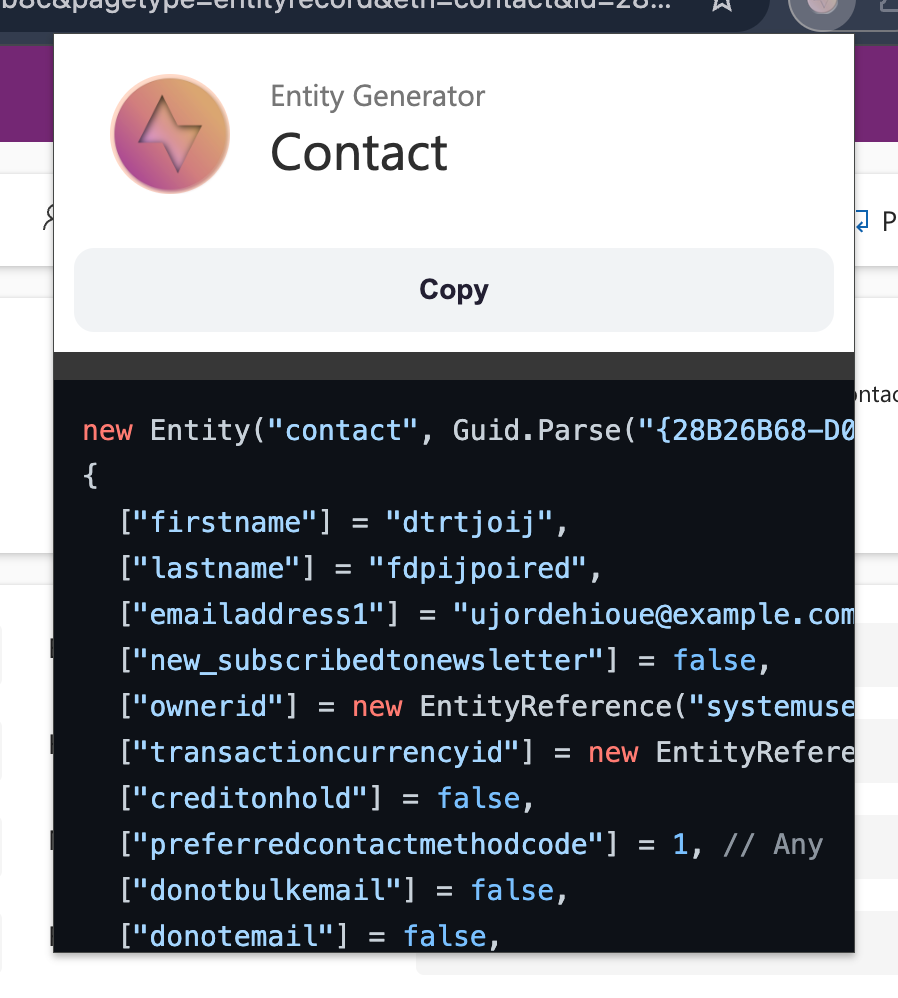

# Dataverse Entity Forge

A professional Chrome/Edge browser extension for generating C# entity code, JSON, and test data from Microsoft Dataverse / Dynamics 365 forms.

## Features

- **C# Entity Generation** — Generate ready-to-use C# `Entity` initialization code for unit tests
- **JSON Generation** — Generate OData-compatible JSON from entity attributes
- **Copy to Clipboard** — One-click copy of generated output
- **Download C# Files** — Download generated C# code as `.cs` files
- **Download JSON Files** — Download generated JSON as `.json` files
- **Form Fields Mode** — Generate from fields currently on the form
- **All Fields Mode** — Generate from all available entity attributes
- **Non-null Filter** — Exclude fields without values
- **Dark Mode** — Professional dark theme with persistence
- **Automatic Detection** — Detects Dataverse entity forms automatically

## Supported Field Types

String, Boolean, Money, Decimal, Integer, Double, Lookup, OptionSet, MultiSelect OptionSet, DateTime, Memo, File, Image

## Installation

1. Clone or download this repository
2. Open your browser and go to `chrome://extensions` (Chrome) or `edge://extensions` (Edge)
3. Enable **Developer mode**
4. Click **Load Unpacked**
5. Select the cloned/downloaded folder
6. Pin **Dataverse Entity Forge** to the toolbar for quick access

## Usage

1. **Navigate** to a Dynamics 365 / Dataverse entity record form
2. **Click** the Dataverse Entity Forge extension icon in your toolbar
3. **Choose** your output format: **C#** or **JSON**
4. **Select** field scope: **Form fields** (default) or **All fields**
5. **Toggle** the "Non-null only" filter if needed
6. **Review** the generated output in the code area
7. **Copy** to clipboard or **Download** as a `.cs` / `.json` file

## Dark Mode

Click the sun/moon icon in the header to toggle between light and dark themes. Your preference is automatically saved and persists across sessions.

## Download

Generated files are named using the entity logical name:

- `account-test-data.cs`
- `contact-test-data.json`

If the entity name is unavailable, files are named `dataverse-entity-test-data.<ext>`.

## How It Works

1. The extension injects a worker script into the Dynamics 365 page
2. The worker reads entity metadata via `Xrm.Page`
3. Attributes are forwarded to the popup via Chrome messaging
4. The popup generates C# or JSON from the retrieved attributes
5. Entity set mappings are fetched from the Dataverse metadata API for JSON lookup resolution

## Browser Compatibility

- Google Chrome
- Microsoft Edge

## License

See [LICENSE](LICENSE) file.
